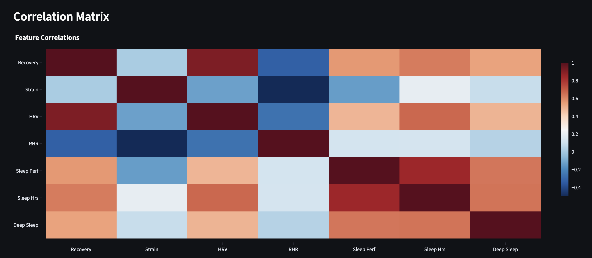
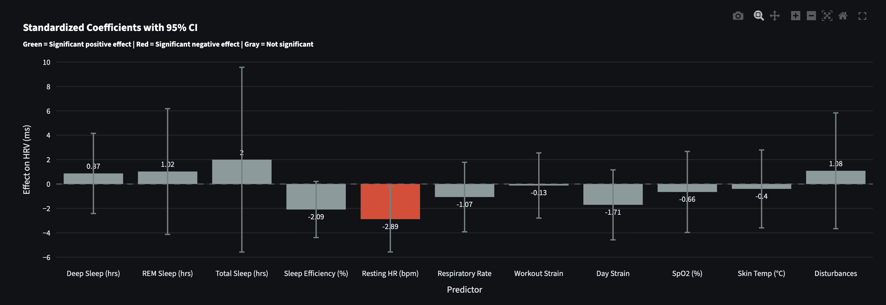
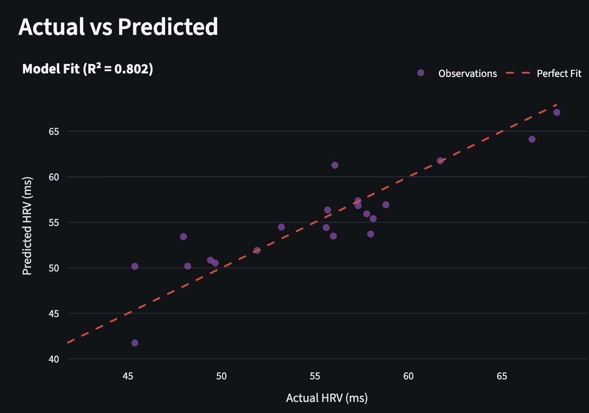

# Whoop Dashboard

Personal fitness dashboard with automated sync and MLR models for Recovery and HRV prediction.

Example dashboard: https://ido-pi.tail9eb77e.ts.net/

See [SETUP.md](SETUP.md) for detailed instructions on how to deploy.

### Correlation Analysis

The correlation matrix shows relationships between key metrics - helping identify which factors most impact recovery and HRV.

### Model Coefficients

Positive coefficients increase the predicted value, negative coefficients decrease it. The magnitude shows the strength of each factor's influence.

### Prediction Accuracy

The closer points align to the diagonal line, the more accurate the predictions. 

## Features

- **Automated Sync** - Daily data sync at configurable time
- **Interactive Dashboard** - Recovery, sleep, heart rate, workouts
- **MLR Models** - Predict recovery & HRV from sleep, strain, HRV
- **Auto-backup** - 30-day retention database backups
- **HTTPS** - Caddy reverse proxy with auto SSL
- **Easy Sharing** - Tailscale Funnel for public access

## Dashboard Tabs

- **Recovery & Strain** - Daily trends
- **Sleep** - Stages, performance, efficiency  
- **Heart Rate** - Avg, max, RHR, HRV
- **Workouts** - Activity history
- **Insights** - Correlation analysis
- **MLR Recovery** - Predict recovery
- **MLR HRV** - Predict HRV

## Data Storage

All data persists in Docker volumes:

- `whoop-data` - Database and auth tokens

## License

MIT
