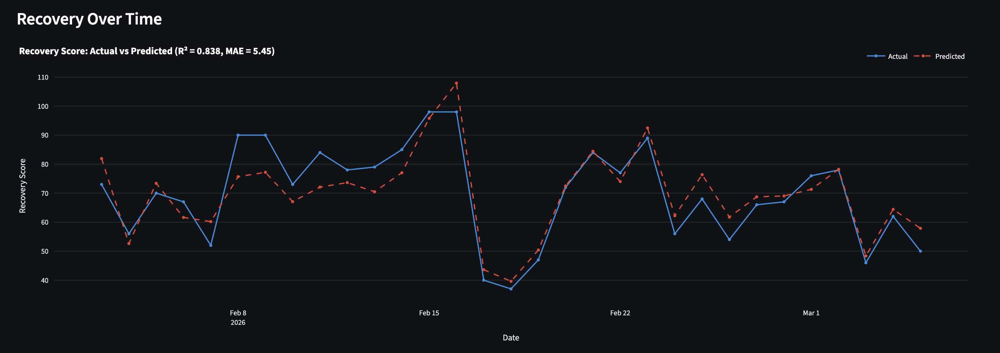
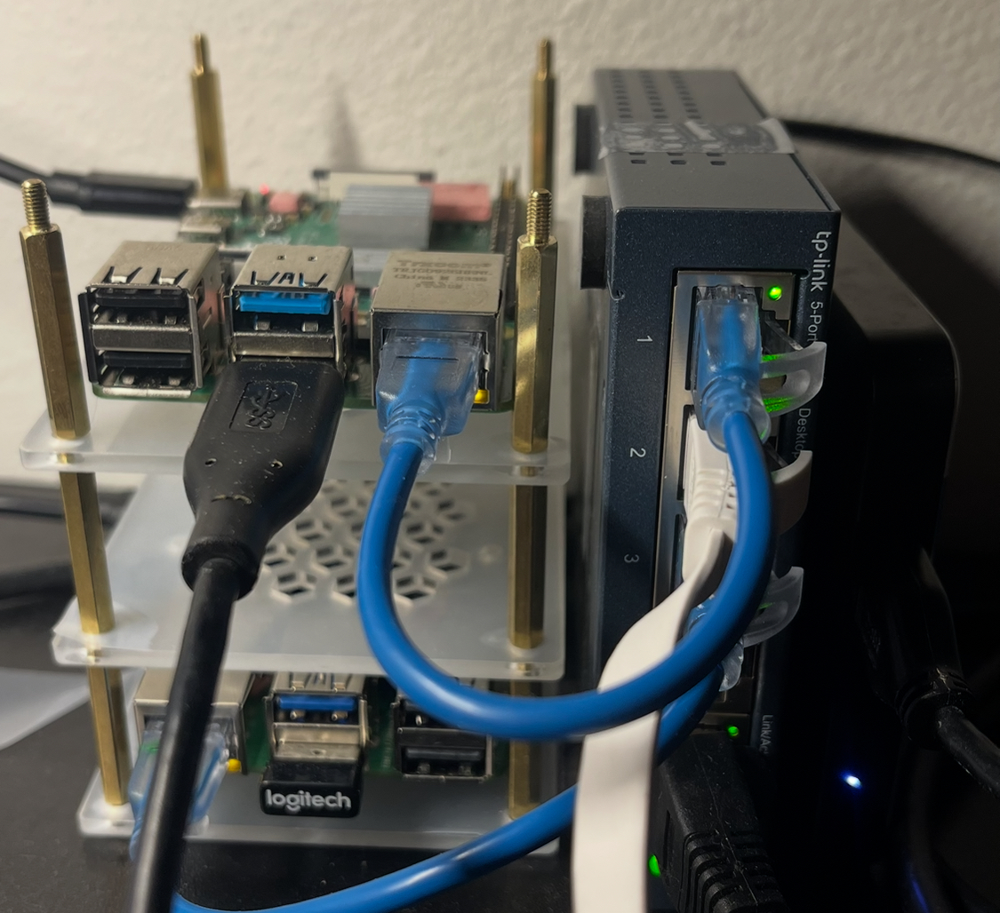
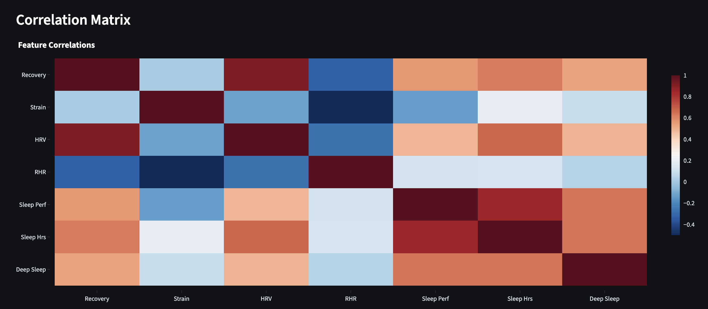
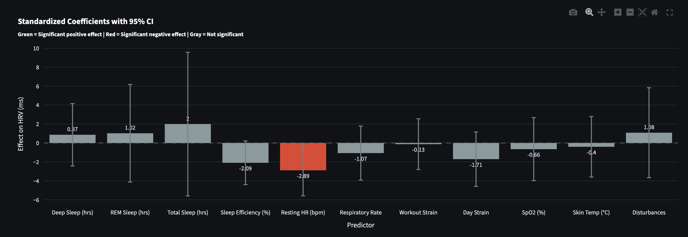
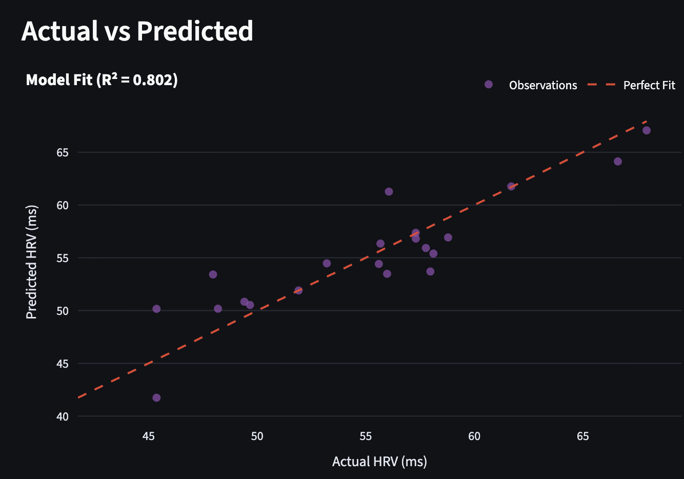

# WHOOP Insights

Automated data pipeline, inferential statistical modeling, and interactive dashboard for personal WHOOP wearable data.

> **Note:** Despite the regression outputs, this is not a predictive model — it is an inferential one. The goal is to understand which physiological variables are most associated with recovery and HRV, not to forecast future values. Coefficients are interpreted for insight, not deployed for prediction.

example: https://ido-pi.tail9eb77e.ts.net/




---

## Architecture

```
WHOOP API (v2) --> OAuth 2.0 Sync Engine --> SQLite3 --> Streamlit Dashboard
                        |
                   Cron (daily)
```

The platform ingests physiological data from the WHOOP REST API through an OAuth 2.0-authenticated sync engine. Records are upserted into a normalized SQLite database (6 tables, indexed queries). A Streamlit dashboard reads directly from SQLite to render interactive Plotly visualizations and regression model outputs across 7 analytical tabs.

## Hardware:


*Two-node Raspberry Pi cluster connected to a home router via switch, with SSD storage. The dashboard container is kept up-to-date automatically via Watchtower and syncs data daily through cron. The site is exposed publicly and continuously over HTTPS using Tailscale Funnel.


---

## Tech Stack

| Category | Technology | Purpose |
|---|---|---|
| Language | Python 3.11 | Core application logic |
| Database | SQLite3 | 6 normalized tables, indexed columns, upsert operations |
| API | WHOOP REST API v2 | Paginated data ingestion with cursor-based pagination |
| Auth | OAuth 2.0 | Authorization code grant with automatic token refresh |
| Dashboard | Streamlit | 7-tab interactive analytics interface |
| Visualization | Plotly | Scatter, bar, pie, heatmap, histogram, subplots |
| ML / Statistics | Ridge Regression (scikit-learn) | Recovery score and HRV prediction |
| Data Processing | Pandas, NumPy | Transformation, aggregation, feature engineering |
| Containerization | Docker | Single-container deployment with health checks |
| Scheduling | Cron | Automated daily data sync pipeline |
| CI/CD | Watchtower | Automated container image updates |

---

## Features

- **Automated data pipeline** -- incremental sync queries the database for the latest record and fetches only new data; supports full historical re-sync and selective endpoint targeting
- **OAuth 2.0 authentication** -- complete authorization code flow with embedded callback server, automatic token refresh with exponential backoff, and persistent token storage
- **7-tab analytics dashboard** -- recovery/strain trends, sleep stage breakdowns, heart rate time series, workout distribution, correlation analysis, and two regression model tabs
- **Predictive modeling** -- Ridge Regression predicting Recovery Score (6 features) and HRV (up to 11 features) with standardized coefficients and timeline visualization of predicted vs actual values
- **Normalized database** -- 6 tables with indexed high-query columns, upsert operations for idempotent syncs, singleton constraints
- **Production deployment** -- Dockerized on Raspberry Pi cluster, Watchtower for rolling updates, structured logging with rotation

---

## Dashboard

### Correlation Matrix


### Model Coefficients (Standardized)


### Prediction Accuracy


---

## Quick Start

Prerequisites: Docker, Docker Compose, and [WHOOP Developer API credentials](https://developer-dashboard.whoop.com/).

```bash
git clone https://github.com/idossha/whoop_insights.git
cd whoop_insights
cp .env.example .env
# Edit .env with your WHOOP_CLIENT_ID, WHOOP_CLIENT_SECRET, and WHOOP_REDIRECT_URI
```

```bash
docker compose up -d
docker compose exec dashboard python main.py auth      # Complete OAuth flow in browser
docker compose exec dashboard python main.py sync --full  # Initial data pull
```

Dashboard available at `http://localhost:8501`. Daily sync runs automatically via cron.

---

## Project Structure

```
whoop_insights/
|-- main.py                        # CLI entrypoint (auth, sync, stats, status, reauth)
|-- docker-compose.yml             # Dashboard + Watchtower services
|-- Dockerfile                     # Python 3.11-slim with cron
|-- entrypoint.sh                  # Container init: cron, auth check, Streamlit launch
|-- requirements.txt
|
|-- src/whoop_sync/
|   |-- config.py                  # Dataclass-based configuration from env vars
|   |-- auth.py                    # OAuth 2.0 flow, token management, callback server
|   |-- api.py                     # WHOOP API v2 client with pagination generator
|   |-- db.py                      # SQLite layer with upsert operations
|   |-- models.py                  # Dataclass models + SQL schema definitions
|   |-- mlr.py                     # Ridge regression models (scikit-learn)
|   |-- sync.py                    # Sync orchestrator: incremental/full/selective
|
|-- dashboard/
|   |-- dashboard.py               # Streamlit app (7 tabs, Plotly visualizations)
|
|-- scripts/
|   |-- setup.sh                   # One-command setup
|   |-- backup.sh                  # Database backup with gzip + retention policy
|
|-- docs/
|   |-- architecture.svg
|   |-- correlation_matrix.png
|   |-- coefficients.png
|   |-- actual_vs_predicted.png
```

---

## License

MIT License. See [LICENSE](LICENSE) for details.
